# Práctica Docker Compose

## ¿Qué és Docker?

La idea detrás de Docker es crear contenedores ligeros y portables para las aplicaciones software que puedan ejecutarse en cualquier máquina con Docker instalado, independientemente del sistema operativo que la máquina tenga por debajo, facilitando así también los despliegues.

La virtualización basada en contenedores aísla las aplicaciones entre sí en un sistema operativo (OS) compartido. Los contenedores son portátiles entre diferentes distribuciones de Linux, y son significativamente más pequeños que las imágenes de máquinas virtuales (VM).

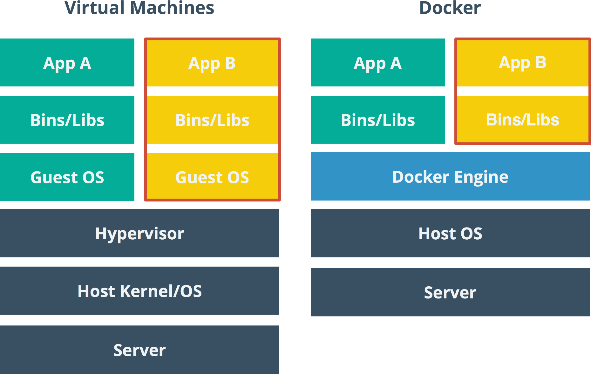

### Características 
Docker es un proyecto de código abierto con el que fácilmente podremos crear "contenedores". Estos contenedores de Docker podríamos definirlos como máquinas virtuales ligeras 

#### Portabilidad
El contenedor Docker podremos desplegarlo en cualquier otro sistema (que soporte esta tecnología), con lo que nos ahorraremos el tener que instalar en este nuevo entorno todas aquellas aplicaciones que normalmente usemos.

#### Ligereza
El peso de este sistema no tiene comparación con cualquier otro sistema de virtualización más convencional que estemos acostumbrados a usar.

Un Ubuntu con Apache y una aplicación web, pesa alrededor de 180Mb, lo que nos demuestra un significativo ahorro a la hora de almacenar diversos contenedores que podamos desplegar con posterioridad.

#### Autosuficiencia.
Un contenedor Docker no contiene todo un sistema completo, sino únicamente aquellas librerías, archivos y configuraciones necesarias para desplegar las funcionalidades que contenga. Asimismo, Docker se encarga de la gestión del contenedor y de las aplicaciones que contenga.

## ¿Qué és Docker Compose?

Docker Compose es una herramienta que permite simplificar el uso de Docker. A partir de archivos YAML es mas sencillo crear contendores, conectarlos, habilitar puertos, volumenes, etc.

Con Compose puedes crear diferentes contenedores y al mismo tiempo, en cada contenedor, diferentes servicios, unirlos a un volúmen común, iniciarlos y apagarlos. Es un componente fundamental para poder construir aplicaciones y microservicios.

## ¿Qué és Prometheus?

Prometheus es un sistema de monitoreo de código abierto basado en métricas. Recopila datos de servicios y hosts mediante el envío de solicitudes HTTP en puntos finales de métricas.

Luego, almacena los resultados en una base de datos de series de tiempo y los pone a disposición para análisis y alertas.

## ¿Qué és Grafana?

Grafana es una herramienta para visualizar datos de serie temporales. A partir de una serie de datos recolectados obtendremos un panorama gráfico de la situación de una empresa u organización.

Grafana está escrita en Lenguaje Go (creado por Google) y Node.js LTS y con una fuerte Interfaz de Programación de Aplicaciones (API).

## Práctica Docker Compose con WebApp, Prometheus y Grafana

Empezamos la práctica creando la estructura de los directorios:

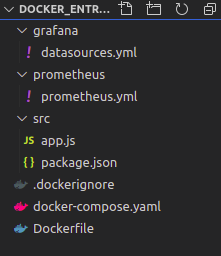

### Web App

#### Con el Dockerfile crearemos la aplicación Web, la cual:
    - Partirá de una imagen de node (versión alpine3.10).
    - Establecerá un directorio de trabajo "myapp" donde residirá el código de la aplicación.
    - Expondrá el puerto publicado por el servidor express.
    - Ejecutará como comando la instrucción necesaria para arrancar el servidor express.

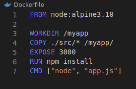

#### En el archivo docker-compose.yml debemos configurar el servicio:
    - El servicio se llama "webapp".
    - Ejecutará un archivo Dockerfile.
    - El nombre del contenedor será "myapp_practica".
    - Utilizará el puerto 3000 del contenedor y el 83 para el host.
    - Pertenecerá a una red común para todos los servicios denominada "network_practica".
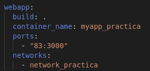

### Prometheus

#### El servicio estará configurado en el archivo docker-compose.yml con los siguientes requisitos:
    - Se basará en la imagen de prometheus "prom/prometheus:v2.20.1".
    - El nombre del contenedor será prometheus_practica.
    - Utilizará el puerto 9090.
    - Se copiará el archivo "prometheus.yml" al directorio /etc/prometheus del contenedor.
    - Ejecutará el comando --config.file=/etc/prometheus/prometheus.yml.
    - Pertenecerá a una red común para todos los servicios denominada "network_practica".
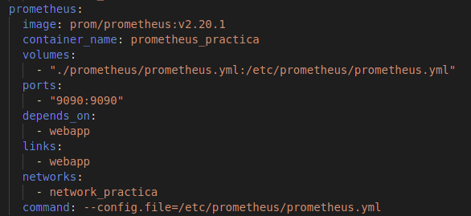

### Grafana

Este servicio será el encargado de graficar todas las métricas creadas por el servicio de Prometheus. Por tanto, siempre arrancará tras él.
#### El servicio estará configurado en el archivo docker-compose.yml con los siguientes requisitos:
    - Se basará en la imagen de grafana "grafana/grafana:7.1.5".
    - El nombre del contenedor será grafana_practica.
    - Utilizará el puerto 3500 de nuestro host y el puerto 3000 del contenedor.
    - Se copiará el archivo "datasources.yml" al directorio /etc/grafana/provision/datasources del contenedor.
    - Utilizará un volumen llamado "myGrafanaVol".
    - Pertenecerá a una red común para todos los servicios denominada "network_practica".
#### Establecer las variables de entorno necesarias para:
        - Deshabilitar el login de acceso a Grafana
        - Permitir la autenticación anónima
        - Que el rol de autenticación anónima sea Admin
        - Que instale el plugin grafana-clock-panel 1.0.1

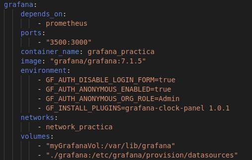

### Docker-compose completo

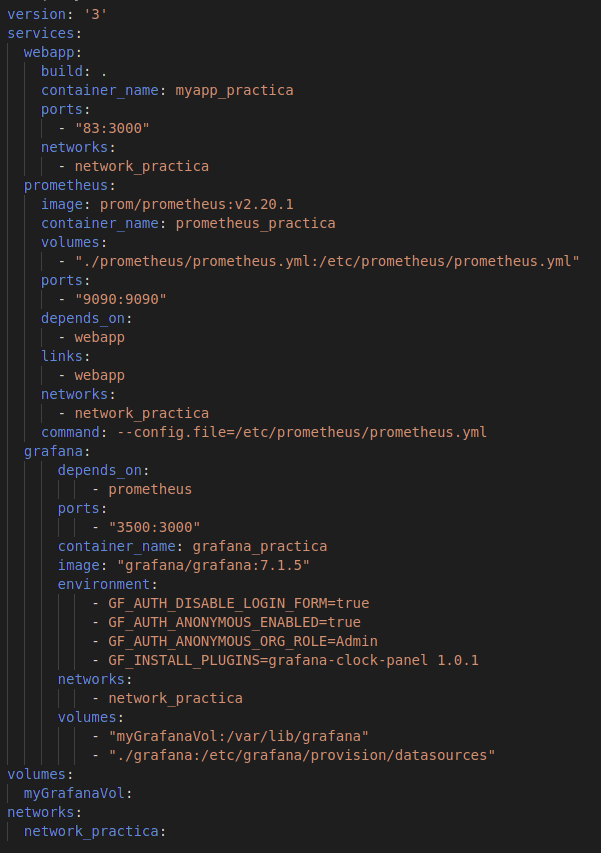

## Verificación del ejercicio

### Accediendo a WebApp
Podemos acceder a la aplicación a través del navegador con la url "localhost:83".
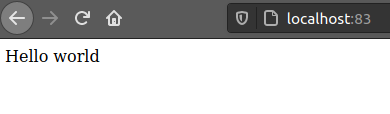

Accederemos varias veces a "localhost:83/message".
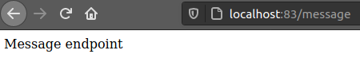

### Accediendo a Prometheus
Para acceder ponemos la url "localhost:9090".
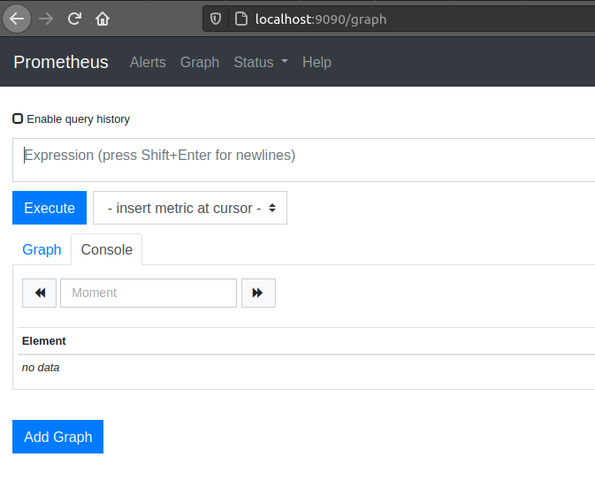

### Accediendo a Grafana
Para acceder ponemos la url "localhost:3500".
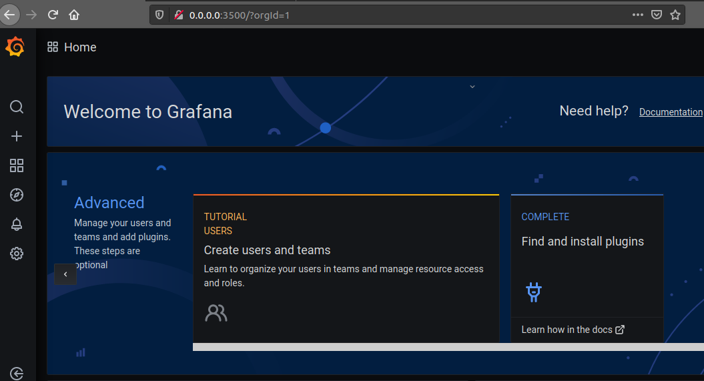

